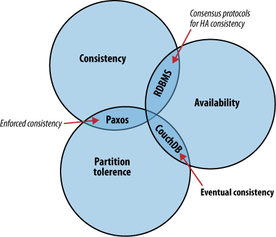

title: Immutable Infrastructure Persistence
author:
  name: Ian Blenke

  url: http://ianblenke.github.io/immutable-infrastructure-persistence
output: index.html
controls: true

--

### Immutable Infrastructure Persistence
#### 12factor, Docker, PaaS (Dokku/Deis), and Fleet
## Ian Blenke @ianblenke
## 
## http://goo.gl/fkHHRA

--

### Persistence

* "Bits on disk"
* Reboot safely

--

### Immutable Infrastructure

* Golden **Images**
* Running **Containers**
* Temporary filesystem
* No Persistence

--

### Current "best practice"

* Separate Persistence layers from Immutable Infrastructure application deployment layers
* Manage Persistence layers with convergence tools
  * Chef
  * Puppet
  * Ansible
  * SALT
  * cfengine2
  * cfengine/isconf/Makefiles...

--

### CAP Theory (Brewer's Theorem)

* Consistency
* Availability
* Partition tolerance

* Paxos / [Raft](http://raftconsensus.github.io/) (http://raftconsensus.github.io/) / Zab / Others
* Gossip membership

--

### CAP Diagram

--

### CAP Implementations used widely today

* Doozer (Paxos) from Heroku (orphaned?)
* [Zookeeper](http://zookeeper.apache.org/) (Zab, only CP) from Yahoo
* [etcd](https://github.com/coreos/etcd) (Raft + Gossip) from CoreOS
* [Serf](https://www.serfdom.io/) (Gossip only) from Hashicorp
* [consul](https://www.consul.io/) (Raft + Gossip) from Hashicorp, built on Serf

--

### What is etcd?

* Part of the CoreOS project
* Written in go
* CAP Theory key/value and membership clustering
* Implementation of RAFT and GOSSIP

--

### What is CoreOS?

* Bare bones pre-built images
* Gentoo fork, no portage
* NO COMPILER
* Self-updating using locksmith and omaha protocol
* Two partition "failsafe" upgrading
* Immutable root filesystem
* Need a tool? Run "toolbox"
* Everything is a docker (or rocket) container
* etcd / fleet / cloud-init "user-data"

--

### Docker

* Immutable infrastructure, by design
* Formalized interface for packaging/deploying
* Layered Images / Volumes
* Ports / Environment variables
* Containers / Links

--

### 

--

### What is Fleet?

* Part of the CoreOS project
* Written in go
* Submits systemd units to member machines
* Built on etcd's RAFT/GOSSIP CAP theory clustering
* Allows for complex scheduling of units given constraints
* As of Fleet 0.8.0+, units can now be "Global" and automatically run on all member nodes

--

### What are Service Units?

* systemd service definitions
* .ini file like syntax

### 

--

### An example fleet unit:

    $ fleetctl cat packetbeat
    [Unit]
    Description=Packetbeat Network Package Summary Metrics Service
    Requires=docker.service
    After=docker.service

    [Service]
    Restart=always
    ExecStartPre=-/usr/bin/docker kill %p
    ExecStartPre=-/usr/bin/docker rm -f %p
    ExecStartPre=/usr/bin/docker pull ianblenke/packetbeat-agent:latest
    ExecStart=/usr/bin/docker run --name %p --net=host -e ES_HOST=172.17.42.1 ianblenke/packetbeat-agent:latest
    ExecStop=/usr/bin/docker stop -t 10 %p
    ExecStop=/usr/bin/docker rm %p
    
    [X-Fleet]
    Global=true

--

### What is cloud-init "user-data"?

* YAML file
* Passed to CoreOS at boot time
* Describes systemd units, writes files, creates users, etc.
* _Can be used to submit fleet units for a new fleet machine member_
  * Many examples of this in:
    * [ianblenke/coreos-vagrant-kitchen-sink](https://github.com/ianblenke/coreos-vagrant-kitchen-sink)

--

### But what about Persistence?

* ObjectStore: [ceph](http://ceph.com/), swift, walrus
* Indexed JSON: [elasticsearch](http://elasticsearch.org) (lucene)
* Time-series: [influxdb](http://influxdb.com), [OpenTSDB](http://opentsdb.net/)
* Memory: redis, couchbase
* Relational: galera (mysql), bigsql.org (PostgreSQL+HBase)
* Wide column: HADOOP HBase, Spark, cassandra
* NoSQL: couchdb, riak, mongo, ...

--

### Killing multiple birds with one stone

* Deis
  * built on CoreOS
  * deis-store-* units for ceph
    * mounts a cluster-wide cephfs at /var/lib/deis/store
    * provides an S3 compatible replicated store
  * deis-database is postgresql using wal-e to backup to ceph
  * Provides us with a Heroku/Dokku-like PaaS

--

### Deis "Contract"

* Same PaaS git push deploy model as Heroku/Dokku
* etcd/systemd/fleet unit based deployment
* deisctl orchestrates unit deployment and upgrades
* deis command wraps user and app config
* docker images built by deis-builder during git push
* ENV metadata layers from "deis config:set"
* Automated incrementing version numbers per deployment
* Rolling version deployments
* per-application memory/cpu constraints

--

### Deis Fleet Service Units

* deis-controller - django RESTful interface, coordinator
* deis-builder - slug builder
* deis-publisher - docker event relay (populates etcd)
* deis-router - nginx reverse proxy
* deis-registry - docker private image repo
* deis-logger - "deis logs" collector and wrapper
* deis-logspout - docker log collector
* deis-database - postgresql + wal-e
* deis-store-gateway - ceph radosgw (S3)
* deis-store-daemon - ceph osd (storage)
* deis-store-monitor - ceph monitor

--

### My Example Fleet Units

* [ianblenke/coreos-vagrant-kitchen-sink](https://github.com/ianblenke/coreos-vagrant-kitchen-sink)
* Vagrant CoreOS with self-orchestrated:
  * Kubernetes, Panamax, libswarm, flannel
  * Kibana, Logstash, Logspout, PacketBeat, ElasticSearch
  * Heapster, Grafana, Influxdb, cadvisor
  * Galera MySQL, Zookeeper, NewRelic Host Agent
  * Librato statsd forwarder
  * Adding new units as I build them

--

### Data "in flight"

* If containers are stopped, their volumes disappear
* Linked container volumes allow for persistence
* Horizontally scaled persistence layer
* Multiple availability zones to _prevent quorum loss_
* Quorum loss is devops sadness (see: ceph-mon)

--

### But what about upgrades?

* Orchestration of upgrades is non-trivial
* Data volumes can contain metadata to allow the docker image to detect and upgrade storage
* A "controller" unit could be used to orchestrate upgrades transparently
* There is a strong need for automated orchestration "distribution"
* Waiting for a re-seed/mirror event to succeed before continuing is important

--

### Is this Persistence safe?

* container volumes can be mounted from host
* stopped "data" container --volumes-from
* Docker 1.20+ --restart=always flag
* Btrfs vs Flocker (ZFS) vs OverlayFS ...

--

### Issues with Ceph

* Require quorum of ceph-mon
* Require &lt; 0.05+ seconds clock drift
* Quite complex

--

### Issues with Fleet

* Dependency on systemd. **Everyone loves systemd**
* Fleet versions younger than 0.7.4 or so get confused as to the actual state of the units
* Fleet versions younger than 0.8.3 have "zombie units" that cannot be killed
* Fleet still doesn't fairly spread units based on load

--

### Issues with etcd

* Disk latency currently causes flapping
  * **peer-election-timeout: 2000**
  * **peer-heartbeat-interval: 500**
* Next major version of etcd will allow delayed writes
* Only 9 members will participate in leader election
  * If more than 4 of these are lost, quorum is lost
* Hundreds of fleet nodes will hammer the master/leaders
* Automated node removal timer defaults to a week

--

### Issues with coreos

* alpha/beta/stable
* Rapid upgrade cycles fixing issues with etcd/fleet
* CoreOS 561+ use ext4 + OverlayFS due to problems with BTRFS
* Upgrading coreos safely with locksmith and omaha protocol

--

### Other risks

* Docker 172.17.42.0/24 "hides" containers between hosts (Flannel addresses this with a VPN)
* Shared nodes means:
  * IO saturation on persistence member nodes starving IO for other layers
  * Only so many pre-defined ports available to be mapped
  * Shared-tenancy deployment not advised - CoreOS fleets should be limited in scope

--

### Real world example

* Chef provisioned i2.8xlarge postgres instances on 8 SSD **ephemeral** (not EBS+PIOPs!) disk RAID-10 arrays
* If stopped, the persistence is _gone_
* The actual persistence safety provided by daily wal-e full backups and streaming wal-e archives to S3 storage

Even with chef provisioned "always on" servers, persistence is not guaranteed, nor is it even necessary.

Retaining CAP quorum is critically important.

--

### Any questions? Comments?

## Ian Blenke [@ianblenke](http://twitter.com/ianblenke)
## email: ian at blenke.com
## work: iblenke at malwarebytes.org
## github.com/ianblenke
## 
## This presentation: http://goo.gl/fkHHRA

